# Data Warehouse using AWS Redshift

## Introduction

The music streaming app start-up, Sparkify, has collected a copious amount of song and user activity data. The data resides in S3 buckets as JSON logs of user activity along with JSON metadata of the songs in the app. The analytics team at Sparkify wants to use this data and deliver insights that can drive business decisions and improve user experience. To achieve this the data needs to be reorganized into a data warehouse hosted on AWS Redshift. The aim of this project is to build an end to end big data ecosystem that supports this data warehouse.

The following are the sub-tasks of this project:
- Build an ETL pipeline that extracts the raw data (around 400K records) from the S3 buckets.
- Stage the data on Redshift clusters.
- Transform it into a set of facts and dimension tables for quick analytics.

## Database Schema

The analytics team at Sparkify is interested in understanding what songs the users listen to frequently. Given this use case, a star schema implementation that is attuned to this requirement is implemented.

A relational database model is ideal for this use case as:

- The data is well structured and can be represented in a tabular format.
- The songs and log data presented are not so large that they mandate the use of big data solutions like NoSQL.# Data Warehouse using AWS Redshift

## Introduction

The music streaming app start-up, Sparkify, has collected a copious amount of song and user activity data. The data resides in S3 buckets as JSON logs of user activity along with JSON metadata of the songs in the app. The analytics team at Sparkify wants to use this data and deliver insights that can drive business decisions and improve user experience. To achieve this the data needs to be reorganized into a data warehouse hosted on AWS Redshift. This project aims to build an end to end big data ecosystem that supports this data warehouse.

The following are the sub-tasks of this project:
- Build an ETL pipeline that extracts the raw data (around 400K records) from the S3 buckets.
- Stage the data on Redshift clusters.
- Transform it into a set of facts and dimension tables for quick analytics.

## Database Schema

The analytics team at Sparkify is interested in understanding what songs the users listen to frequently. Given this use case, a star schema implementation that is attuned to this requirement is implemented.

A relational database model is ideal for this use case as:

- The data is well structured and can be represented in a tabular format.
- The songs and log data presented are not so large that they mandate the use of big data solutions like NoSQL.
- The insights required by the analytics team are simple and can be achieved by using SQL queries.
- The ability to perform JOINs is relevant to this scenario.

### Staging Tables
Before the data is loaded into the respective fact and dimension tables it has to be sourced from the S3 bucket and staged onto the following staging tables in Redshift:

#### 1. **`songs_staging`**

This table fetches the JSON metadata of songs from the S3 bucket. It has the following attributes:

| Attribute        | Data Type |
|------------------|-----------|
| num_songs        | int       |
| artist_id        | varchar   |
| artist_latitude  | decimal   |
| artist_longitude | decimal   |
| artist_location  | varchar   |
| artist_name      | varchar   |
| song_id          | varchar   |
| title            | varchar   |
| duration         | decimal   |
| year             | int       |

#### 2. **`events_staging`**

This table fetches the user activity logs from the S3 bucket and stages them in Redshift. It has the following attributes:

| Attribute     | Data Type |
|---------------|-----------|
| artist        | varchar   |
| auth          | varchar   |
| firstName     | varchar   |
| gender        | varchar   |
| itemInSession | varchar   |
| lastName      | varchar   |
| length        | decimal   |
| level         | varchar   |
| location      | varchar   |
| method        | varchar   |
| page          | varchar   |
| registration  | bigint    |
| sessionId     | int       |
| song          | varchar   |
| status        | int       |
| ts            | bigint    |
| userAgent     | varchar   |
| userId        | int       |

### Fact Table

A single fact table called **`songplays`** is implemented whose records hold log data associated with song plays. It has the following attributes:

| Attribute   | Data Type | Notes                              |
|-------------|-----------|------------------------------------|
| songplay_id | bigint    | auto-incremented (*Primary Key* )  |
| start_time  | timestamp      | timestamp of App usage by user     |
| user_id     | int       | unique integer ID of user          |
| level       | varchar   | user subscription (paid/free)      |
| song_id     | varchar   | song ID of the requested song      |
| artist_id   | varchar   | artist ID of the requested song.   |
| session_id  | int       | browser session ID.                |
| location    | varchar   | user location                      |
| user_agent  | varchar   | browser and OS details of the user |

**NOTE:** It is worthwhile mentioning that the SERIAL command in PostgreSQL for auto-incremented fields is not supported in AWS Redshift. The equivalent command in Redshift is IDENTITY(0,1).

### Dimension Tables

Four dimension tables are created to capture the attributes corresponding to the different data elements. Below is a brief description of the same:

#### 1. **`users`**

This table captures user information like age, gender, name, etc. It has the following attributes:

| Attribute  | Data Type | Notes        |
|------------|-----------|--------------|
| user_id    | int       | *Primary Key * |
| first_name | varchar   | first name of user   |
| last_name  | varchar   | last name of user  |
| gender     | varchar   |  M/F   |
| level      | varchar   | paid/free |

#### 2. **`songs`**

The songs table holds all the information about songs available in the music streaming app like artist name, duration, year of release, etc. It has the following attributes:

| Attribute | Data Type | Notes                |
|-----------|-----------|----------------------|
| song_id   | varchar   |  unique alpha-numeric ID  of the song (*Primary Key*) |
| title     | varchar   |  name of the song   |
| artist_id | varchar   |  |
| year      | int       | release year         |
| duration  | decimal   | length of the song in ms |

#### 3. **`artists`**

Just like the songs table, the artists table holds all the information about artists like name, location, etc. This table has the following attributes:

| Attribute | Data Type | Notes                                              |
|-----------|-----------|----------------------------------------------------|
| artist_id | varchar   | unique alpha-numeric ID  of the artist (*Primary Key*) |
| name      | varchar   | name of artist                                     |
| location  | varchar   | Location of artist                                 |
| latitude  | decimal   | latitude coordinate of the location                |
| longitude | decimal   | longitude coordinate of the location               |

#### 4. **`time`**

The timestamps of records in the songplays table are broken down into specific units and are contained in the time table. The following are the attributes of this table:

| Attribute  | Data Type | Notes                                  |
|------------|-----------|----------------------------------------|
| start_time | time      | time stamp of App usage (*Primary Key*)|
| hour       | int       | Hour of the day (00 - 23)              |
| day        | int       | Day of the week (1-7)                  |
| week       | int       | Week number (1-52)                     |
| month      | int       | Month number (1-12)                    |
| year       | int       | Year of activity                       |

## File Structure  and usage

Along with the logs and song data contained in the S3 bucket, the following files are used in this project:

| File name                  | Description                                                                      |
|----------------------------|----------------------------------------------------------------------------------|
| create_tables.py           | Creates and drops all the relations.                                             |
| create_redshift_cluster.py | Creates a Redshift cluster with configurations as mentioned in dwh.cfg           |
| sql_queries.py             | Contains SQL queries like CREATE, DROP and INSERT.                               |
| etl.py                     | Transforms the staging data and subsequently loads it into the main tables.      |
| delete_resources.py        | Deletes clusters, policies and IAM roles.                                        |
| dwh.cfg                    | Contains configurations pertaining to the data warehouse, Redshift cluster and IAM roles. |
| README.md                  | Contains the project description.                                                |

To use the project the following steps must be performed:
1. Run the **create_redshift_cluster.py** file by using the command: `python3 create_redshift_cluster.py`.
1.1 The cluster endpoint address and IAM role ARN details are printed in the output. Write these values to the `dwh.cfg file.`
Here is a screenshot of the output (with hidden sensetive details):

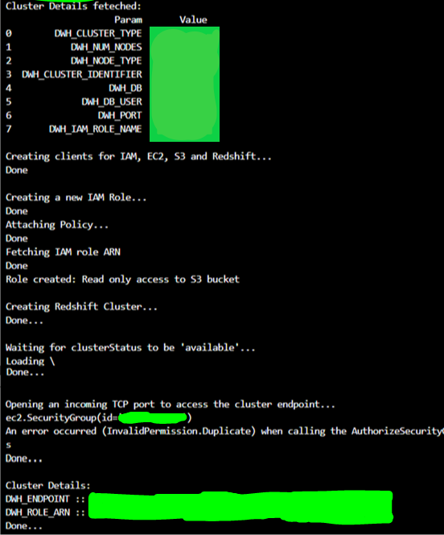
 

2. Run the **create_tables.py** file by using the command: `python3 create_tables.py`.
3. Run the **etl.py** file by using the command: `python3 etl.py`

**Good Practices:** 
- AWS Redshift has an hourly usage cost hence to avoid unanticipated billings it is recommended to delete the Redshift cluster once it is not in use. To delete the cluster along with its IAM role and policies, run the **delete_resources.py** file by giving the command: `python3 delete_resources.py`. The output should look like this:

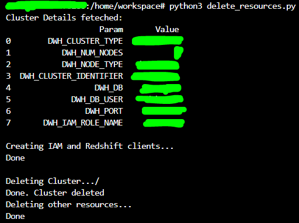

- Never share the AWS Access Key ID and the Secret access key with unauthorized personnel or on public platforms.

## Example Queries/Output :

To test the functionality data warehouse a lot of SQL queries were run in the Redshift query editor interface and their output was verified. In this section a few such queries and their outputs are shown:

#### 1. Show tables:

The following queries were run to view the tables:

##### `SELECT * FROM  songs;`

Output:

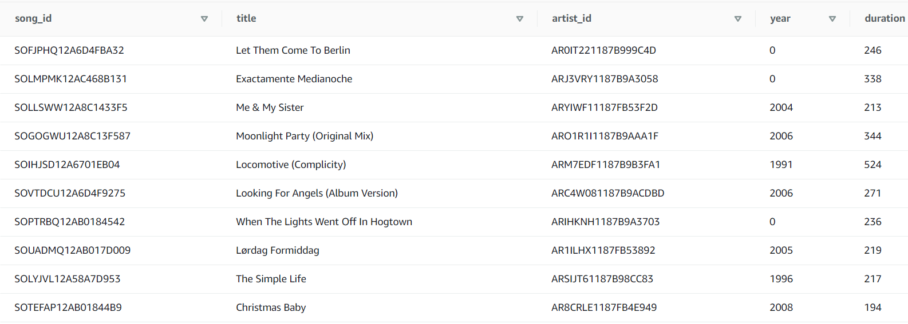

##### `SELECT * FROM artists;`

Output:

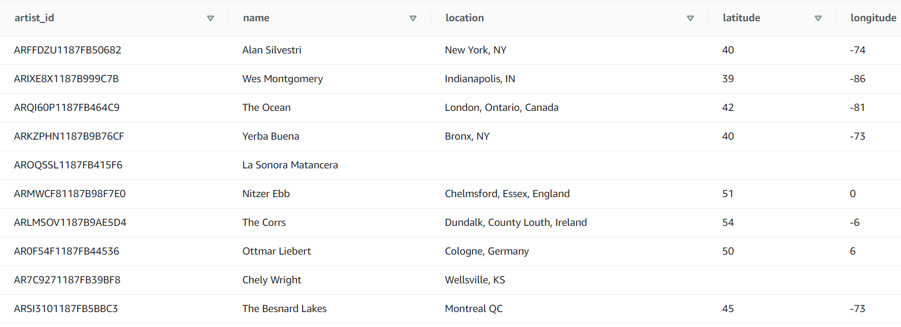

##### `SELECT * FROM  time;`

Output:

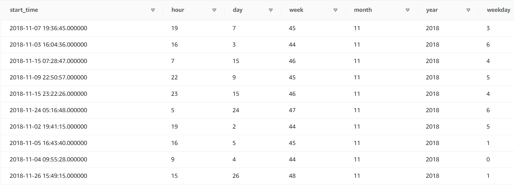

##### `SELECT * FROM  users;`

Output:

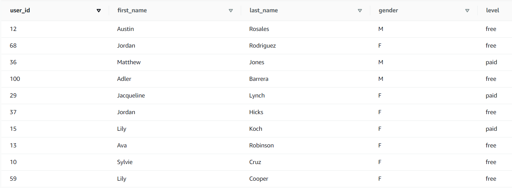

##### `SELECT * FROM  songplays;`

Output:

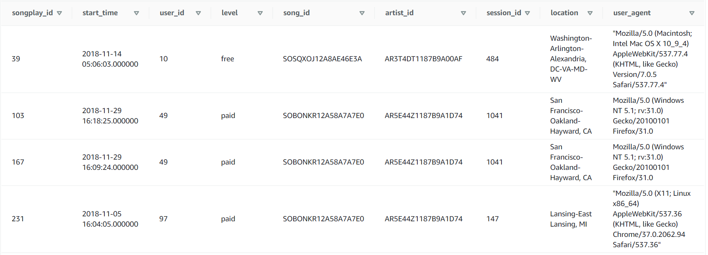

#### 2. Top 10 singles :
The following query was run to view the title and artists of the most frequently played songs:

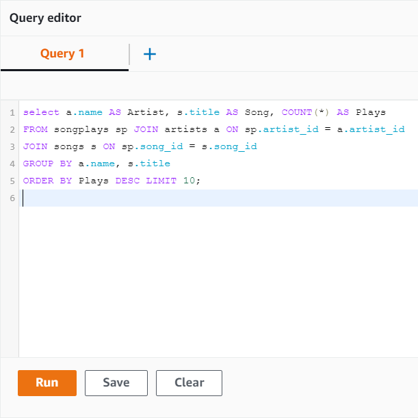

Here is the output:

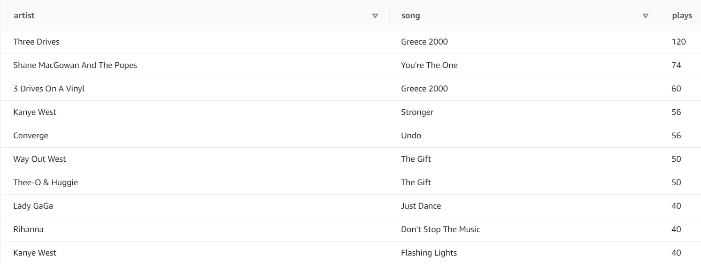

#### 3. Maximum traffic hours :
The following query was run to view the hours which experience the most user traffic:

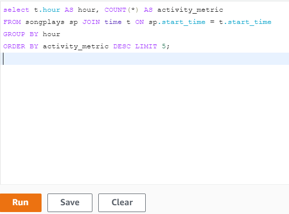

Here is the output:

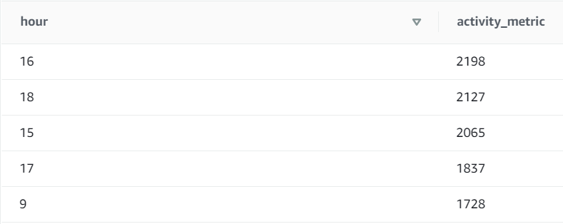

Looks like the majority of user activity is observed between 4:00 PM and 6:00 PM.
